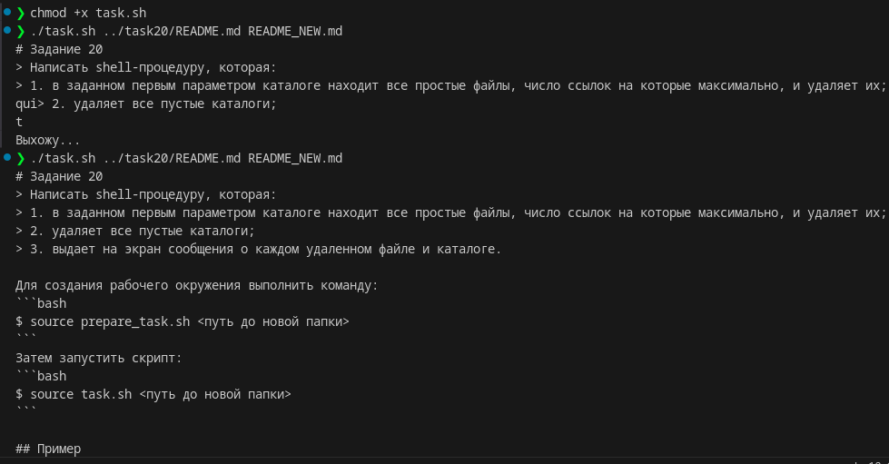

# Задание 40
> Написать shell-процедуру, которая:
> 1. читает содержимое файла, передаваемого в качестве первого параметра; 
> 2. создает новый файл, имя которого передается в качестве второго параметра;
> 3. выводит на экран каждые 7 секунд очередную строку первого файла;
> 4. сортирует все выведенные на экран строки первого файла по длине и записывает их в новый файл;
> 5. при вводе с клавиатуры слова quit удаляет новый файл и завершает работу.

Запустить скрипт:
```bash
$ chmod +x task.sh
$ ./task.sh <первый файл> <второй файл>
```

## Пример
